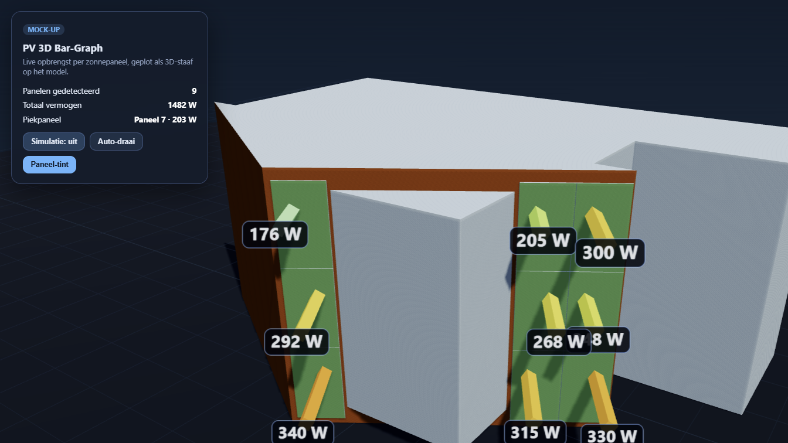

# PV 3D Bar-Graph voor Home Assistant

[](https://github.com/hacs/integration)

Toont de live opbrengst van je individuele zonnepanelen als een 3D-visualisatie
op een model van je gebouw. Elk paneel wordt herkend in een GLB-model en de
achtergrond van het paneel vult zich van onderaf op — van **zwart (0 W)** via
**blauw** naar **groen** bij vol vermogen.



## Functies

- Laadt een GLB-model van je gebouw en **detecteert automatisch de PV-panelen**
  (herkenbaar aan de zwarte kleur).
- Per paneel een platte, van onderaf oplopende **kleurvulling** (zwart → blauw →
  groen) plus een kleine waarde-uitlezing in de rechterbovenhoek.
- Koppel elk gedetecteerd paneel aan een bestaande Home Assistant-sensor.
- Transparante materialen (bijv. ramen) uit de GLB worden correct weergegeven.
- Configuratie via een eenvoudig YAML-bestand of direct in de kaart.

## Installatie via HACS

1. Ga in Home Assistant naar **HACS**.
2. Klik rechtsboven op de drie puntjes → **Custom repositories**.
3. Voeg toe:
   - **Repository:** `https://github.com/bentimmerman/HA_Solar_3D`
   - **Type:** `Integration`
4. Zoek daarna in HACS naar **PV 3D Bar-Graph** en klik op **Download**.
5. **Herstart Home Assistant.**
6. Ga naar **Instellingen → Apparaten & services → Integratie toevoegen** en
   voeg **PV 3D Bar-Graph** toe (registreert de kaart en assets).

## Je eigen model gebruiken

Het meegeleverde voorbeeldmodel is `house2.glb`. Om je eigen gebouw te tonen:

1. Exporteer een GLB waarin de PV-panelen een **zwarte** kleur hebben.
2. Plaats het bestand in
   `custom_components/pv_3d_bargraph/frontend/<jouw_model>.glb`.
3. Verwijs ernaar via `model_url: /pv_3d_bargraph/<jouw_model>.glb`.

> Exporteer met dezelfde (originele) oriëntatie als het voorbeeldmodel; de
> integratie past altijd dezelfde vaste rotatie toe zodat de plaatsing klopt.

## Configuratie

Er zijn twee manieren om panelen aan sensoren te koppelen.

### 1. Via een YAML-bestand (aanbevolen)

Maak `config/pv_3d_bargraph.yaml`:

```yaml
model_url: /pv_3d_bargraph/house2.glb
panels:
  - id: panel_01
    entity: sensor.pv_paneel_1_power
    name: Paneel 1
    max_value: 370
  - id: panel_02
    entity: sensor.pv_paneel_2_power
    name: Paneel 2
    max_value: 370
  # ... enzovoort
```

Voeg vervolgens een kaart toe aan je dashboard:

```yaml
type: custom:pv-3d-bargraph-card
title: Zonnepanelen — live opbrengst
```

De kaart laadt de koppeling automatisch uit `pv_3d_bargraph.yaml`.

### 2. Volledig in de kaart

```yaml
type: custom:pv-3d-bargraph-card
title: Zonnepanelen — live opbrengst
model_url: /pv_3d_bargraph/house2.glb
max_value: 370
unit: W
auto_rotate: false
tint_panels: true
show_labels: true
panels:
  - id: panel_01
    entity: sensor.pv_paneel_1_power
    name: Paneel 1
```

Weet je de paneel-id's nog niet? Voeg de kaart toe **zonder** `panels:` — de
kaart toont dan de automatisch gedetecteerde id's zodat je ze kunt overnemen.

## Kaartopties

| Optie          | Standaard                     | Beschrijving                                        |
| -------------- | ----------------------------- | --------------------------------------------------- |
| `model_url`    | `/pv_3d_bargraph/house2.glb`  | Pad naar het GLB-model.                             |
| `max_value`    | `350`                         | Waarde (in `unit`) die overeenkomt met een vol paneel. |
| `unit`         | `W`                           | Eenheid van de waarde.                              |
| `auto_rotate`  | `false`                       | Automatisch ronddraaien.                            |
| `tint_panels`  | `true`                        | De kleurvulling per paneel tonen.                   |
| `show_labels`  | `true`                        | Waarde-uitlezing per paneel tonen.                  |
| `panels`       | `[]`                          | Lijst met `id` → `entity` koppelingen.              |

## Kleurschaal

- **0 W** → zwart
- oplopend → **blauw**
- vol vermogen (`max_value`) → **groen**

## Licentie

Uitgebracht onder de [MIT-licentie](LICENSE).
